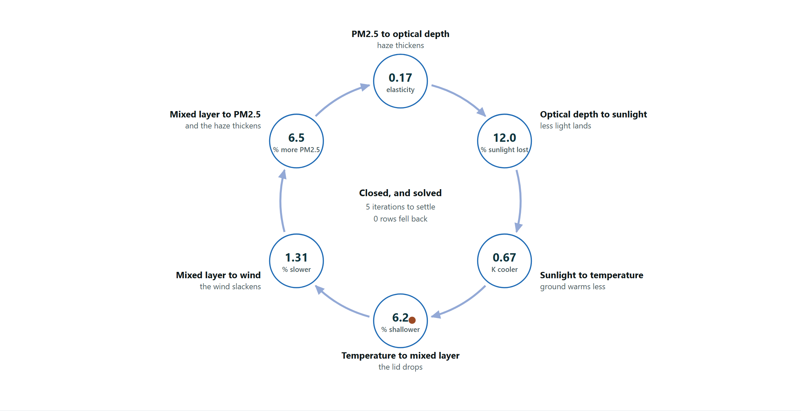
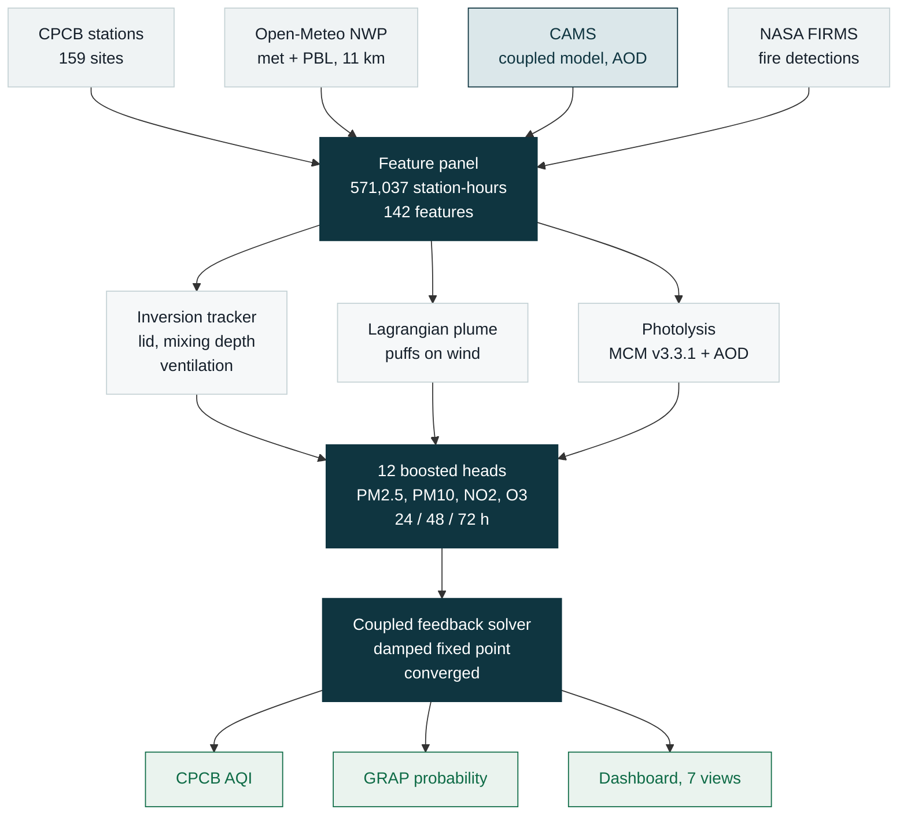
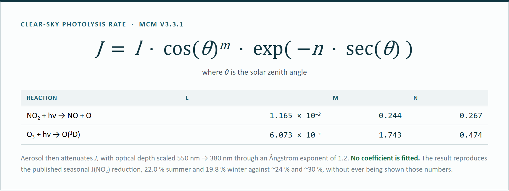
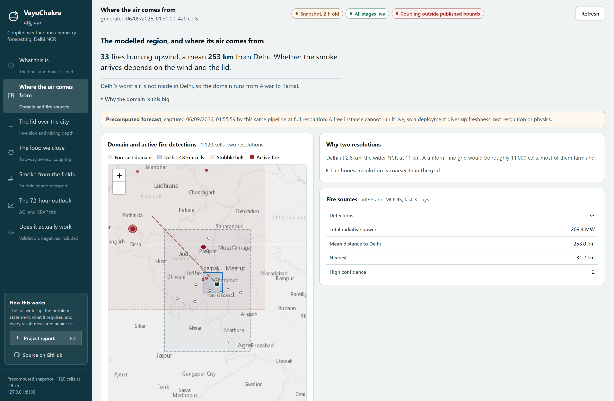
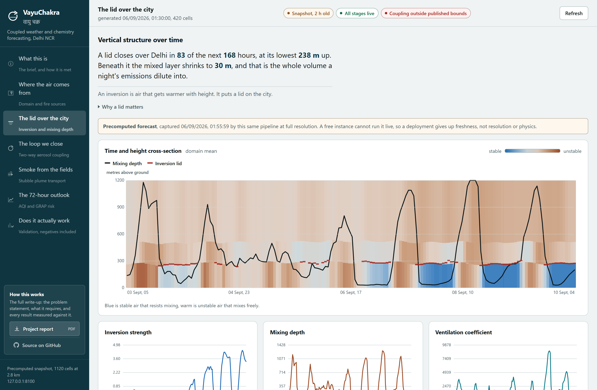
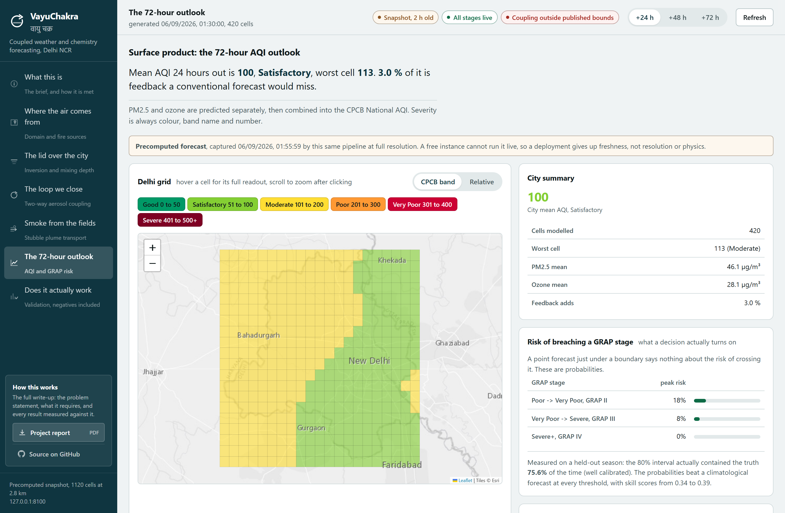
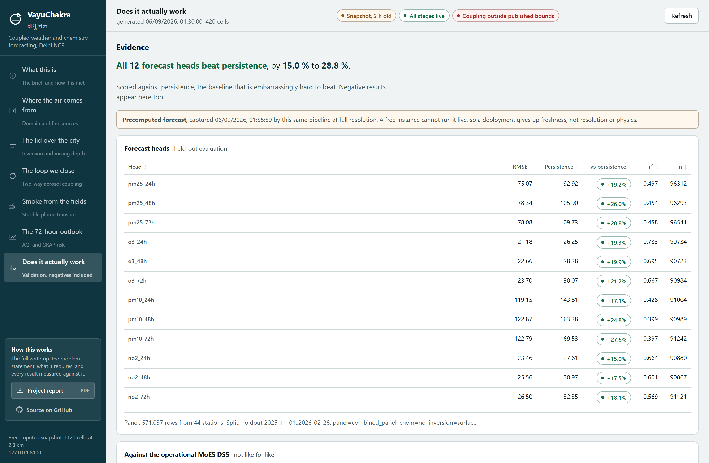
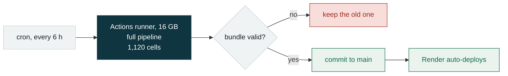

# VayuChakra · वायु चक्र

**A 72-hour air quality forecast for Delhi NCR where the weather and the chemistry are solved together.**

*Vayu chakra* means "the air cycle", and the cycle is the point.

### ▶ [vayuchakra.onrender.com](https://vayuchakra.onrender.com)

> Give it a minute on the first click. It sleeps on a free instance and wakes slowly.
> There is no keep-alive, on purpose.

<br>



*The loop the project is named after, with live values. Because the last step feeds the
first, it is **solved** to convergence, not evaluated once.*

---

## The problem in four lines

Smog blocks sunlight → the ground stays cold → the lid over the city stays low → the same
emissions are packed into less air → **the smog thickens** → it blocks more sunlight.

Almost every AQI forecast models the first arrow only. The MoES brief calls leaving out
the rest a source of *"significant inaccuracies"*. We closed it, then measured whether
closing it helped.

---

## What it does

| | |
|---|---|
| 🔄 **Two-way coupling** | Aerosol → sunlight → temperature → mixed layer → wind → concentration → aerosol. Iterated to convergence, every response clipped, **8 of 8** magnitudes inside published Delhi ranges |
| 🌫️ **Inversion tracking** | The lid over the city as a first-class quantity: strength in K, height in m, mixing depth, ventilation, and a time-height cross section |
| 🔥 **Stubble transport** | Satellite fire detections advected on forecast wind. Reports **arrival**, not ignition |
| ☀️ **Photolysis** | MCM v3.3.1 rates attenuated by aerosol. The pathway that governs ozone, 3–10× stronger than the radiation route |
| 📊 **72-hour outlook** | 1,120 cells · 2.8 km over Delhi · 11 km across NCR · CPCB National AQI |
| 🎲 **GRAP risk** | Probability of crossing AQI 200 / 300 / 400, not a point estimate next to a threshold |

---

## How it works



---

## The chemistry model

Three layers, and it matters which is which.

| Layer | What it is | What it gives us |
|---|---|---|
| **Chemistry prior** | CAMS - ECMWF's operational global model with **online chemistry and interactive aerosol** | PM2.5, PM10, O₃, NO₂, aerosol optical depth, dust |
| **Explicit mechanism** | Our own code | Photolysis, bimodal aerosol optics, the radiative feedback, plume transport |
| **Statistical layer** | 12 boosted-tree heads | Physical state → measured concentration |

The one reaction we integrate ourselves is **photolysis**, the pathway that governs ozone:



**We do not have a full gas-phase mechanism** - no NOx–VOC–ozone cycle integrated forward,
no emissions inventory.

### Why not WRF-Chem

We measured it rather than assumed. On a 16 GB CI runner: **compiling alone takes up to 4
hours** of a 6-hour limit, a 72-hour run needs **12–18 hours** on 4 cores, and peak memory
is **10–12 GB with no swap**. It is a national modelling centre's programme, not a
hackathon's. So we consume an operational coupled model (CAMS) and add our own physics on
top - which is what the brief's *"or similar open-source coupled frameworks"* admits.

---

## The AI, in one table

**12 models. 4 pollutants × 3 horizons.** Each takes 142 numbers and returns one.

| | What it is | 24 h | 48 h | 72 h |
|---|---|---|---|---|
| **PM2.5** | Fine soot. The dangerous one | +19.2 % | +26.0 % | +28.8 % |
| **PM10** | Coarse dust, construction, desert | +17.1 % | +24.8 % | +27.6 % |
| **NO₂** | Combustion gas, mostly vehicles | +15.0 % | +17.5 % | +18.1 % |
| **O₃** | Made in the air by sunlight | +19.3 % | +19.9 % | +21.2 % |

*Improvement over persistence ("tomorrow = today") on a **held-out winter** the models
never saw. All 12 beat it. Plus 5 quantile heads for the GRAP probabilities.*

**Gradient-boosted trees, not a neural network.** Tabular data of this size, native
handling of missing readings, and - critically - we can see which features it leaned on.
Physics enters as *features*: mixing depth, inversion strength, ventilation coefficient and
photolysis rates are **computed** and handed in, not rediscovered. The model ranks our
ventilation coefficient above most of the raw meteorology it came from.

---

## Does it work?

| Test | What it rules out | Result |
|---|---|---|
| **Held-out winter** | "It memorised last winter" | ✅ 12 of 12 beat persistence |
| **Leave-one-station-out** | "It only works where there's a monitor" | ✅ 10 of 10 improved, **+31.6 %** |
| **Ozone counterfactual** | "It's just pattern matching" | ✅ +12.79 % vs published +25 %, never fitted |
| **Quantile calibration** | "Its confidence is made up" | ✅ 80 % interval covers 75.6 % |
| **Coupling ablation** | *nothing - this one went against us* | ❌ **−0.11 %** overall, +0.35 % in high aerosol |

That last row stays in. A system that only reports its wins has not been validated.

---

## The interface

Seven views, named for the physics rather than for pages.

| | |
|:--|:--|
|  |  |
| **Where the air comes from** - the full domain, the stubble belt, live fire detections | **The lid over the city** - a time-height cross section, stability as fill, the lid marked where it exists |
|  |  |
| **The 72-hour outlook** - CPCB AQI per cell, GRAP crossing risk | **Does it actually work** - every validation number, negatives included |

The cross section is the one that did not exist before. On a 168-hour window the lid is
present in 95 hours and absent in 73, and **absence is drawn as absence** rather than
joined through: "no lid" and "a lid at ground level" are opposite statements.

---

## Run it

```bash
pip install -r requirements.txt
python -m pytest -q                    # 94 offline tests, no network, no keys
uvicorn api.main:app --port 8100       # live pipeline at full resolution
```

Open <http://127.0.0.1:8100>. Two keys are optional and free
([OpenAQ](https://openaq.org), [FIRMS](https://firms.modaps.eosdis.nasa.gov)); without
them those stages degrade and say so rather than failing.

<details>
<summary><b>Rebuilding the training data and models</b></summary>

```bash
python scripts/build_dataset.py --start 2025-02-01 --end 2026-08-31
python scripts/train.py                # 12 heads + 5 quantile heads
python scripts/validate.py             # ablation + DSS comparison
python scripts/loso.py                 # leave-one-station-out
```
Panels cache to parquet, and the raw observation archive caches separately, so a failed
assembly does not cost another download.
</details>

---

## Deployment

The free web tier has 512 MB; the pipeline peaks near **1.1 GB**, so it cannot run there
at any resolution. Instead a **GitHub Actions runner with 16 GB runs the real pipeline
every six hours**, commits the result, and Render serves it.



A deployment gives up **freshness, not resolution or physics**. The validator rejects a
bundle whose forecast did not come from the trained models, which is a check that was
missing once and cost us a week of silently model-free forecasts.

---

## What this is not

- **Not WRF-Chem.** No radiative transfer solve, no chemical mechanism integrated forward, no emissions inventory. A coupled surrogate, bounded by published observations.
- **No VOC chemistry.** Delhi's winter ozone is VOC-limited as well as radiation-limited. We model only the radiation half.
- **A single chemical layer.** Vertical structure is diagnosed and drawn, not resolved. The two-layer replacement is built and tested but not yet promoted, pending a score against the MoES DSS.
- **The DSS comparison is not a skill claim.** Our RMSE is lower, but lead times are not strictly matched. We say what it does support: the statistical layer maps meteorology to PM2.5 competitively.

---

## Layout

```
vayuchakra/     the science: feedback, photolysis, plume, twolayer, indices, aqi
api/            FastAPI, 15 routes, serves the dashboard from the same origin
dashboard/      the seven-view interface, one file, no build step
scripts/        dataset, train, validate, loso, export_snapshot
models/         metrics and results (boosters are released, not committed)
docs/           the full report PDF and its source
```

| Document | For |
|---|---|
| **[docs/VayuChakra-Report.pdf](docs/VayuChakra-Report.pdf)** | The full write-up: the brief clause by clause, every result with its file, what remains |
| **[DECISIONS.md](DECISIONS.md)** | 63 decisions with the measurement behind each, negative results included |
| **[REFERENCES.md](REFERENCES.md)** | Every paper, dataset, API and library, with what each is used for |
| **[DESIGN.md](DESIGN.md)** | The design system, including why the palette avoids the AQI ramp |

---

<sub>Built for the Ministry of Earth Sciences / NCMRWF problem statement *Air Pollution and
Weather Coupled Forecasting System (Delhi NCR Focus)*. Third-party sources are cited, never
redistributed.</sub>
